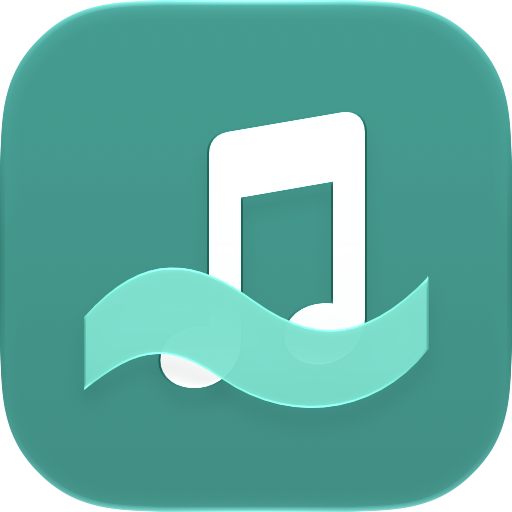
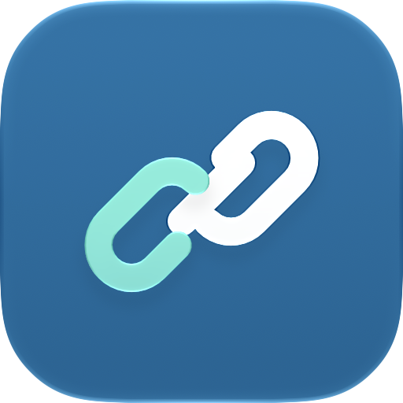

<p align="center">
  
  
</p>

# SurfLyrics

Spotify에서 듣고 있는 곡의 동기화 가사를 macOS 메뉴 막대에 표시하는 개인용 앱입니다.

**Spotify 클라이언트 → LRCLIB → Musixmatch** 순서로 가사를 찾습니다. 간주에는 대기 상태와 같은 큰 음표를 표시하고, 다음 가사가 시작되면 다시 텍스트로 바뀝니다. 시간 정보가 없는 가사는 재생 위치에 맞춘 가사로 표시하지 않습니다.

## 설치

**Apple Silicon Mac · macOS 27 이상**이 필요합니다. Spotify 데스크톱 앱에 로그인되어 있어야 합니다.

1. TestFlight에서 이 변경이 포함된 **SurfLyrics** 빌드를 설치합니다.
2. **SurfLyrics Connection Helper.app**을 `/Applications`에 한 번 설치합니다.
3. SurfLyrics 설정 → **가사 소스**에서 **Spotify 가사 자동 연결 (개인용)**을 켭니다.

이후 터미널을 실행하거나 곡마다 가사를 가져올 필요가 없습니다. 연결이 필요하면 앱이 도우미를 실행하고, 도우미가 Spotify를 잠시 재시작한 뒤 종료됩니다. 기존 연결이 있으면 그대로 사용합니다.

**[다른 Mac에 설치하기 →](docs/INSTALL.md)** · **[개발 및 검증 →](docs/DEVELOPMENT.md)**

## 도우미 설치 파일 만들기

빌드할 Mac에는 **Xcode 27**과 이 프로젝트의 Apple 서명 인증서가 필요합니다. 설치할 Mac에는 Xcode가 필요하지 않습니다.

```sh
git clone https://github.com/aloedawn/SurfLyrics.git
cd SurfLyrics
bash scripts/package-helper.sh
```

결과는 `build/SurfLyrics-Helper-1.0-macOS-arm64.dmg`와 SHA-256 체크섬입니다. 다른 Mac으로 옮겨 도우미를 응용 프로그램 폴더에 드래그합니다. 빌드 결과는 저장소에 포함하지 않습니다.

기본 서명은 `Apple Development`입니다. Developer ID 서명을 사용하려면 다음처럼 지정합니다.

```sh
SURFLYRICS_SIGNING_IDENTITY='Developer ID Application: Your Name (2RDF6J3XVV)' \
  bash scripts/package-helper.sh
```

개발용 서명과 Apple 공증은 다릅니다. 이 스크립트는 공증이나 GitHub Release 게시를 자동 실행하지 않습니다. 다른 Mac의 최초 실행 승인과 공증 배포 방법은 [설치 안내](docs/INSTALL.md)를 참고하세요.

## 동작과 제한

- 본 앱은 샌드박스와 TestFlight 배포를 유지합니다. 도우미는 별도로 설치하며 관리자 권한, 로그인 항목, 상주 서비스가 필요하지 않습니다.
- 재연결 중 같은 곡이 선택되어 있으면 재생 위치와 재생·일시정지 상태를 복구합니다. 사용자가 바꾼 곡을 이전 곡으로 되돌리지 않습니다.
- 연결 실패 시 켜져 있는 다음 가사 소스로 넘어갑니다. 반복 재시작을 막기 위해 자동 재시도에는 대기 시간이 있습니다.
- 도우미는 `127.0.0.1:43827`에만 연결을 엽니다. 같은 Mac의 다른 프로세스도 이 디버깅 연결에 접근할 수 있습니다. 자동 연결을 끄면 이후 준비를 중단하며, Spotify를 완전히 종료하면 연결도 닫힙니다.
- Spotify 세션 안에서 가사를 요청하며 쿠키와 접근 토큰을 복사하거나 저장하지 않습니다. Spotify 내부 구조 변경으로 연결이 깨질 수 있어 **모든 곡의 100% 수신을 보장하지 않습니다**.

## 프로젝트 구성

| 경로 | 내용 |
| --- | --- |
| `SurfLyrics/` | 메뉴 막대 앱, 가사 공급자, 자동 연결, Icon Composer 원본 |
| `SpotifyConnectionHelper/` | 연결 준비 후 종료하는 도우미와 아이콘 원본 |
| `SurfLyricsTests/` | 가사 매칭·순서·취소·연결 실패 등 핵심 회귀 검사 |
| `scripts/` | 도우미 빌드·패키징과 브리지 검사 |
| `docs/` | 설치·개발 안내와 아이콘 미리보기 |

## 라이선스

[GNU GPL v3](LICENSE). 가사의 권리는 각 권리자에게 있으며, 이 저장소에는 실제 가사나 Spotify 인증 정보가 포함되어 있지 않습니다.
